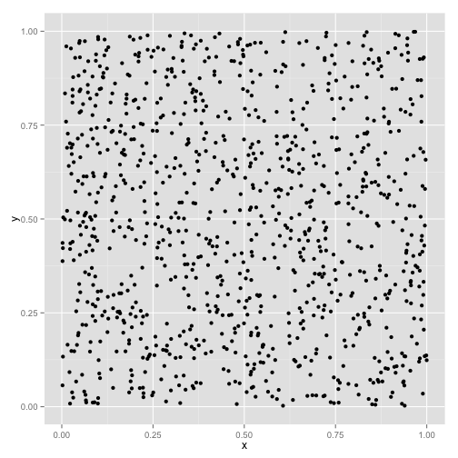
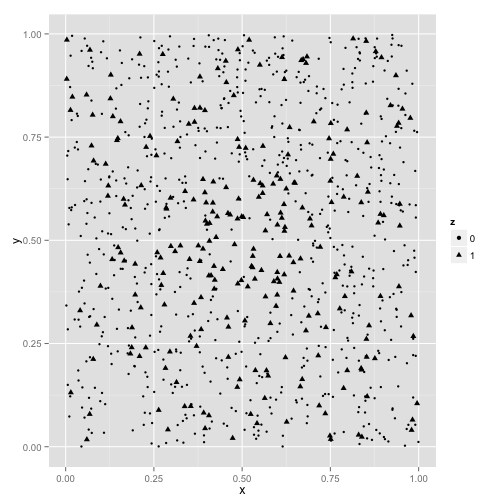

### Hotspot Mapping in R

Simple hotspot mapping with the the distance-based-mapping algorithm of Jeffery et al. 

Requires [ggplot2](http://ggplot2.org).

The following is a quick demo showing how a simple hotspot map can be generated from a set a dataset consisting of a set of (x,y) points and a vector of case/control designations labeled z.

## Demo

Import `hotspotr`:


```r
require(hotspotr)
```


Generate a set of (x,y) points in the unit square:


```r
x <- runif(1000)
y <- runif(1000)
```


 


Using the `random_hotspot` function in `hotspotr`, place an area of increased risk in the center of the square. In this case, we'll select an area covering the middle 30% of the unit square where 80% of individuals within this are are cases and only 20% outside of it are cases, for a relative risk of 4:


```r
hs <- random_hotspot(x, y, 0.3, 0.8, 0.2)
```

Create a new data frame with case points labeled as z = 1  and controls as z = 0:


```r
hs <- data.frame(x = x, y = y, z = as.factor(hs[["z"]]))
```


We can plot this and see that there is a greater density of cases (represented by triangles) in the center:

 

<!-- 
hs <- random_hotspot(x,y, 0.30, 0.8, 0.2)

cr <- hs[["coord"]]
hs <- data.frame(x = x, y = y, z = as.factor(hs[["z"]]))

x <- hotspot_map(hs, dbm_score_rr, p = 0.03, color_samples = 100, pbar = TRUE)
plot(x)

``` -->
