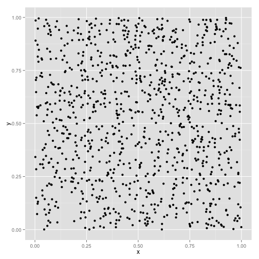

# Hotspot Mapping in R

Simple hotspot mapping. Currently based on the distance-based-mapping algorithm of Jeffery et al. This package is functional but under active development. 

Requires [ggplot2](http://ggplot2.org).

To install, make sure you have the `devtools` package installed and loaded and run:

```r
require(devtools)
install_github("jzelner/hotspotr")
```
## Demo
The following is a quick demo showing how a simple hotspot map can be generated from a set a dataset consisting of a set of (x,y) points and a vector of case/control designations labeled z.

Import `hotspotr`:


```r
require(hotspotr)
```


Generate a set of (x,y) points in the unit square:


```r
x <- runif(1000)
y <- runif(1000)
```


 


Using the `random_hotspot` function in `hotspotr`, place an area of increased risk in the center of the square. In this case, we'll select an area covering the middle 30% of the unit square where 80% of individuals within this are are cases and only 20% outside of it are cases, for a relative risk of 4:


```r
hs <- random_hotspot(x, y, 0.3, 0.8, 0.2)
```

Create a new data frame with case points labeled as z = 1  and controls as z = 0:


```r
hs <- data.frame(x = x, y = y, z = as.factor(hs[["z"]]))
```


We can plot this and see anecdotally that there is a greater density of cases (represented by triangles) in the center:

 


We can verify whether this area of increased density is statistically significant using the `hotspot_map` function in `hotspotr`. 

The first argument to `hotspot_map` is the data frame with columns `x`, `y`, and `z` with x and y coordinates and case/control designations, respectively. The second argument is the density estimation method to use (currently only the distance-based-mapping method of Jeffery et al. is supported (as the function `dbm_score_rr`). 

User-defined density functions can easily be written. All that is required is a function of the form `fn(hs)` that returns a density measure at each (x,y) point in the `hs` dataframe. `p` specifies the width of the smoothing window, and `color_samples` specifies the number of random permutations of case/control designations to use when generating the color scale for the map:


```r
hm <- hotspot_map(hs, dbm_score_rr, p = 0.03, color_samples = 100, pbar = FALSE)
```


We can then plot the resulting map and see that in fact the area at the center of the map represents a likely hotspot: 


```r
plot(hm)
```

 

